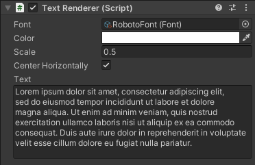
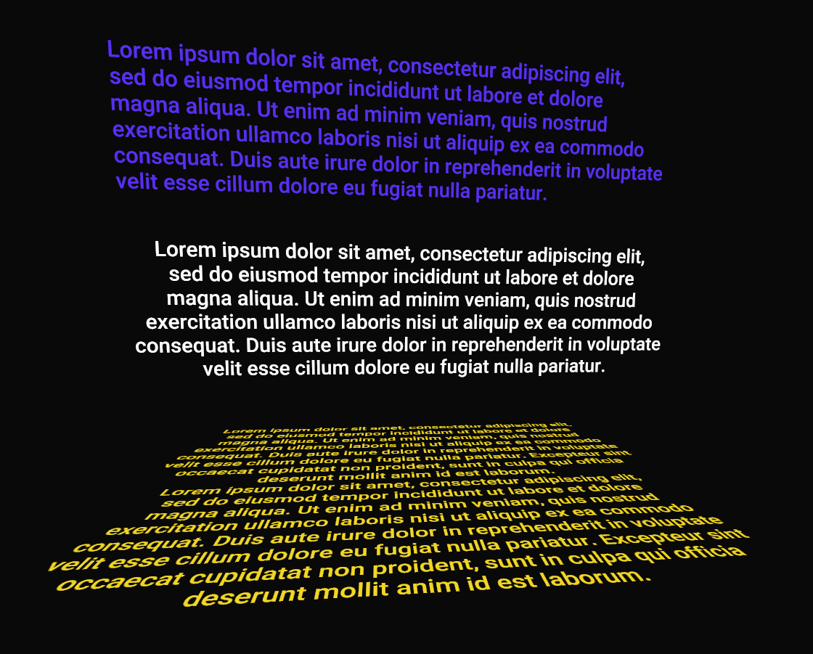

# TextRenderer

TrueType font file reader and renderer implemented in Unity. Bezier glyph rendering is based on Eric Lengyel's [Slug algorithm](https://jcgt.org/published/0006/02/02/). Font assets can be created from `Create -> Font Asset` to which the .TTF file can be dragged onto. Component by name Text Renderer can be used to render these Font Assets:

Example of rendered text shown below:

